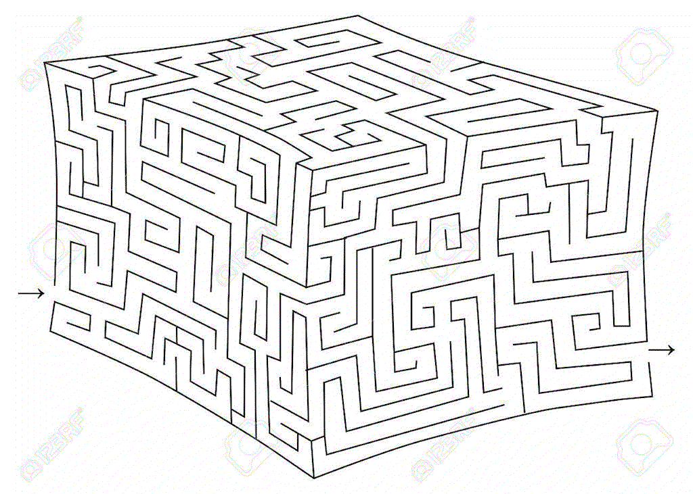

# CV Maze Solver #

This package attempts to provide a relatively quick computer vision solution to most mazes.


### How it works ###

Currently, maze_solver
reads in images of mazes,
performs thresholding and thinning,
and then converts the remaining "on" pixels to a network.
A simple keyboard UI allows the user to update the starting and ending points.
The maze is solved using a simple dijkstra algorithm.

### Todo ###

The next steps in this project are to

* Add a CLI to allow user to run on their own mazes
* Save the name of the file and the starting and ending points in a cache file.
* Allow the user to use a camera instead of an image.
* Allow the user to use the mouse to specify starting and ending positions
* Handle color mazes - thresholding and thinning

### How do I get set up? ###

```bash
python -m venv venv
pip install -r requirements.in
source venv/bin/activate

./maze_solver.py
```

### Written by ###

John Lee Cooper  
john.lee.cooper@gatech.edu
  

